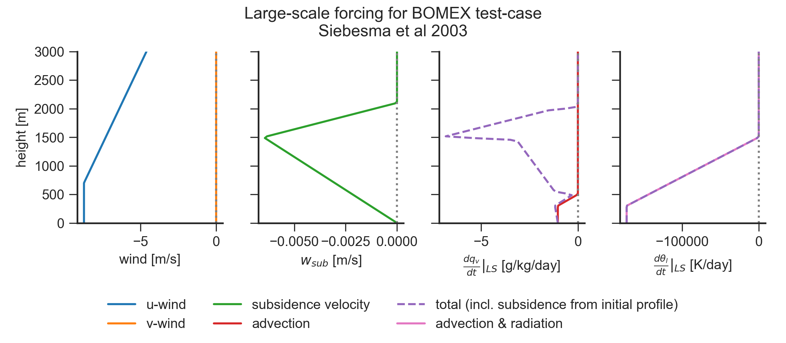

# BOMEX non-precipitating shallow cumulus

Observational campaign EOL link: https://www.eol.ucar.edu/field_projects/bomex

Field experiment published in Holland and Rasmusson (1973) and Nitta and
Esbensen (1974).

LES setup published in Siebesma, A. P., and coauthors, 2003: A large-eddy
simulation intercomparison study of shallow cumulus convection. J. Atmos. Sci.,
60, 1201-1219

## Aims

- primary object to determine the rate of transfer of water vapor, heat and 

## Characteristics (*needs verifying*):

- no precipitation (precipitation was turned of in microphysics of original
intercomparison)

- no cloud-deck formed at inversion height (which was observed in ATEX case)

## Conclusions from observation

- condensation and evaporation processes associated with the development and
  dissipation of trade-wind cumulus can make a significant contribution to the
  heat balance of the cloud and trade wind inversion layers

## LES setup

